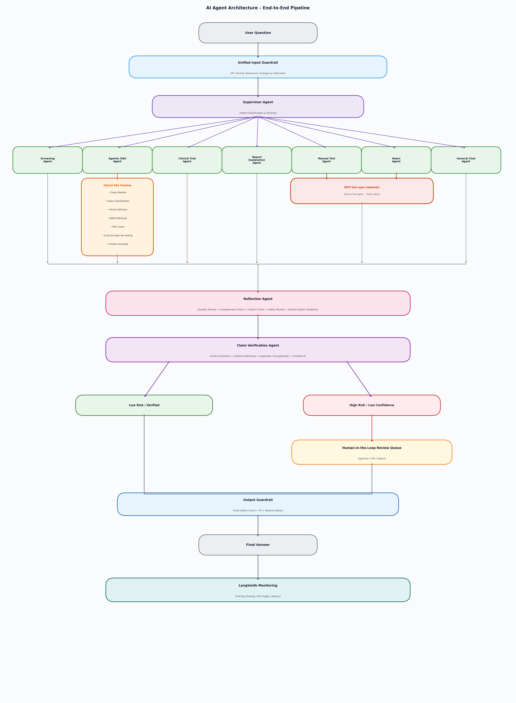

# Description
OncoGuide is a proof-of-concept (POC) open-source agentic AI system designed to support cancer patients, caregivers, clinicians, and researchers with safe and evidence-based cancer information.

The system is built on a multi-agent pipeline that routes each user query through a unified input guardrail for safety screening, followed by a supervisor agent that classifies intent and directs it to one of seven specialised agents: symptom screening, hybrid retrieval-augmented generation (RAG), clinical trial matching, medical report explanation, deterministic tool calling, reasoning-and-acting (ReAct), and general conversation.

The hybrid RAG pipeline combines query rewriting, vector retrieval, BM25 keyword search, reciprocal rank fusion, and cross-encoder re-ranking to retrieve evidence from trusted biomedical sources including NCI PDQ, PubMed, ClinicalTrials.gov, ClinVar, and CIViC.

In this POC phase, all agents are powered by a single Groq-hosted open-source model to validate the architecture and pipeline before optimisation. Future iterations will adopt a task-selective model strategy, assigning different models from providers such as OpenAI or Anthropic based on the role and complexity requirements of each individual agent.

All responses pass through a reflection agent, a claim verification agent, and a final output guardrail. High-risk outputs are escalated to a human reviewer. The full pipeline is traced via LangSmith.

# OncoGuide Agentic AI

An open-source multi-agent AI system for:

- Cancer symptom screening
- Medical report explanation
- Evidence-based medical Q&A
- Clinical trial discovery
- Human-in-the-loop validation

---

# Architecture

---

# Key Features

## Multi-Agent Architecture

- Supervisor Agent
- Screening Agent
- Agentic RAG Agent
- Clinical Trial Agent
- Report Explanation Agent
- Manual Tool Agent
- ReAct Agent
- General Chat Agent

## Safety Layers

- Unified Input Guardrail
- Reflection Agent
- Claim Verification Agent
- Human-in-the-Loop Review
- Output Guardrail

## Hybrid RAG

- Query Rewrite
- Query Classification
- Vector Retrieval
- BM25 Retrieval
- RRF Fusion
- Cross-Encoder Re-ranking
- Context Assembly

## MCP Integration

- PubMed MCP
- ClinicalTrials MCP
- Vector DB MCP
- File System MCP

## Observability

- LangSmith Tracing
- Agent Routing Monitoring
- Tool Usage Tracking
- Latency Monitoring

---

# Technology Stack

| Component | Technology |
|------------|------------|
| LLM | Groq |
| Orchestration | LangGraph |
| RAG | LlamaIndex |
| Vector DB | ChromaDB / Qdrant |
| Monitoring | LangSmith |
| Evaluation | RAGAS, DeepEval |

---

# Current Pipeline

User Question

→ Input Guardrail

→ Supervisor

→ Specialized Agent

→ Reflection Agent

→ Claim Verification Agent

→ Human Review (if needed)

→ Output Guardrail

→ Final Answer

---

# Documentation

Detailed technical guide available in:

docs/OncoGuide_Agentic_AI_Updated.docx

---

# Research Direction

This project is being developed toward a publication-quality medical agentic AI system featuring:

- Hybrid Biomedical RAG
- MCP Tool Integration
- Claim Verification
- Human-in-the-Loop Validation
- LangSmith Observability
